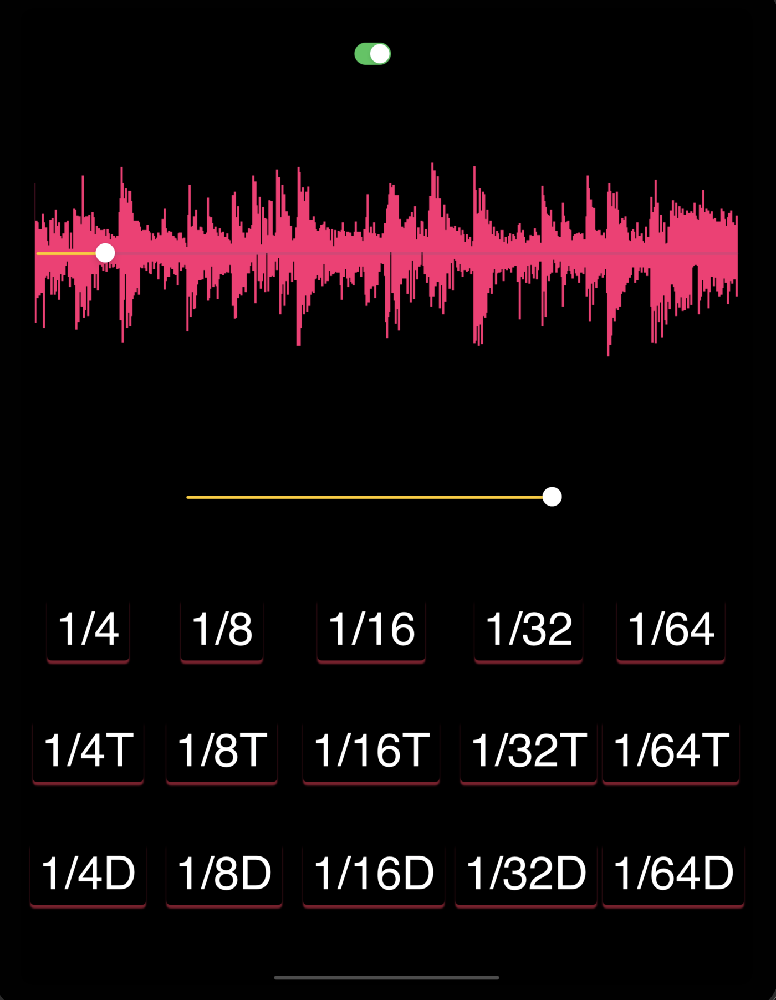

# BreaKiT
<!--## _The Last Markdown Editor, Ever_-->

<!---->

<!---->

This iOS app is a sample manipulator, triggering a stuttering effect that works in tempo subdivisions. It is based on the *repeater* device by the **Renoise** tracker software.

<!--- Type some Markdown on the left-->
<!--- See HTML in the right-->
<!--- ✨Magic ✨-->

## Design

<!--- Import a HTML file and watch it magically convert to Markdown-->
<!--- Drag and drop images (requires your Dropbox account be linked)-->
<!--- Import and save files from GitHub, Dropbox, Google Drive and One Drive-->
<!--- Drag and drop markdown and HTML files into Dillinger-->
<!--- Export documents as Markdown, HTML and PDF-->

This effect is achieved by having two separate playback headers moving through the sample and having one of them loop around certain sections of the sample depending on the button pressed. Once the button is released the loop header can join the position of the normal playback header and continue on until another button is pressed. A filter is also added as an extra effect, controlled by a slider.

